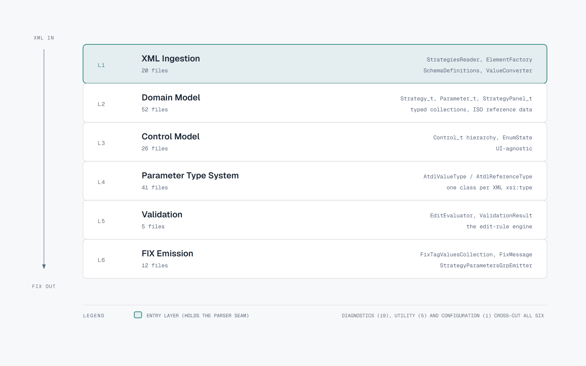
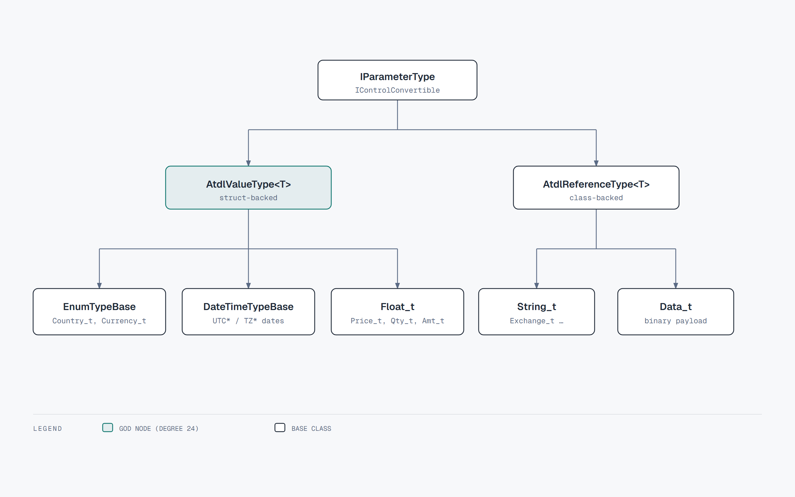
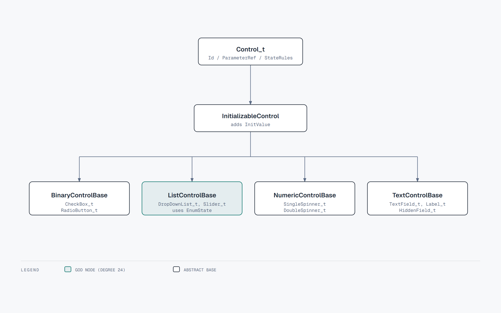

# FixPortal.FixAtdl — Architecture

A navigable map of the library, derived from two whole-repo graph passes
that are **generated locally and gitignored** (`graphify-out/`,
`.understand-anything/`). Rebuild with `/graphify` and `/understand` after
a clone; do not expect those directories in a fresh checkout.

This document is the prose synthesis of both. For "where is X / what calls Y"
on a machine that has rebuilt the graphs, query them rather than grepping.

## What this library is

A **headless** .NET 10 library that turns a FIXatdl v1.1 strategy XML document
into a navigable object model, validates user input against the document's edit
rules, and emits the resulting **FIX tag values**. It is *not* a FIX engine (the
host sends the tags) and *not* a UI library (consumers wire their own UI onto the
parsed model). Modernised fork of [Atdl4net](https://github.com/atdl4net/atdl4net).

## The pipeline (data flow)

The whole library is one pipeline from an XML stream to FIX tag values. The
guided tour walks it; this is the short form:

Source: [`docs/diagrams/pipeline.html`](../diagrams/pipeline.html) — open in a browser to edit, then re-export.

Inside `Strategy_t` the aggregate holds four collections, each owned by a different
layer: `Parameters` (`Parameter_t`, the type system), `StrategyPanel_t → Controls`
(the control model), and `StateRules` / `StrategyEdits` (both resolving to `Edit_t`
in the validation layer).

Two facts make this design what it is:

1. **The parser is data-driven, not hand-written.** `ElementFactory` knows
   nothing about FIXatdl specifically — it reflects over `SchemaDefinitions`
   (a static table of `ElementDefinition`s) to map any XML element to a C# type,
   set constructor parameters, and recurse into children. Adding a new element
   type is a table edit, not a parser change. This is the single most
   load-bearing seam in the codebase (see *Load-bearing components*).
2. **Construction is two-phase.** Deserialization builds the object tree; a
   second `ResolveAll()` pass wires cross-references (`EditRef_t` → `Edit_t`,
   controls ↔ parameters) once every node exists. `StrategiesReader.StrategyLoaded`
   fires *after* deserialization but *before* full validation — treat it as
   "deserialized", not "valid".

## Layers

The understand-anything pass assigned every file-level node to one of 9 layers.
The counts are that pass's record and drift as files are added — `Fix/`,
`Utility/` and `Configuration/` were re-counted against the tree in September
2026; the three `Model/` rows and `XML Ingestion` are still the graph's figures:

The diagram is the scan view of the six pipeline layers; the table below is the
reference, and adds the three cross-cutting layers the stack omits.

| Layer | Files | What lives here |
|---|---:|---|
| **XML Ingestion** | 20 | `StrategiesReader` (entry point), `ElementFactory`, the `ElementDefinition` family, `SchemaDefinitions`, `ValueConverter`, `AtdlNamespaces` — the data-driven deserialization engine. |
| **Domain Model** | 52 | `Strategies_t`/`Strategy_t`/`Parameter_t`/`StrategyPanel_t`/`StateRule_t`, the typed **Collections**, **Enumerations**, and ISO **Reference** data. The parsed strategy as objects. |
| **Control Model** | 26 | `Control_t` → `InitializableControl` → {`Binary`/`List`/`Numeric`/`Text`ControlBase} and the concrete `*_t` controls; `EnumState`, `IControlVisitor`. The UI-control abstraction (UI-agnostic). |
| **Parameter Type System** | 41 | `AtdlValueType` / `AtdlReferenceType` roots, `EnumTypeBase`, `DateTimeTypeBase`, integer bases, and every concrete `*_t` value type. Each XML `xsi:type` → a C# class that parses/formats its FIX wire value. |
| **Validation** | 5 | `EditEvaluator`, `EditValueConverter`, `ValidationResult`, `ControlValidationState`, `IValueProvider` — the edit-rule engine. |
| **FIX Emission** | 12 | `FixTagValuesCollection`, `FixTag`, `FixField` (generated tag constants), `FixFieldValueProvider`, `FixMessage`, `StrategyParametersGrpEmitter` — the library's output. |
| **Diagnostics** | 19 | `FixAtdlException` hierarchy (11 subclasses), `ThrowHelper` (reflective exception factory), and the three localized `Resources` resx/designer pairs. |
| **Utility** | 5 | `IParentable`, `IResolvable`, `ModelUtils`, `StringExtensions`, `DataEntryMode` (defined, unused). |

`Domain Model` and `Control Model` are kept separate deliberately: the
`Model/Controls` subtree is its own abstract base-class hierarchy, architecturally
independent of the `Elements`/`Collections` subtree.

## Two parallel type hierarchies

The library has **two** independent inheritance trees. Confusing them is the most
common mistake, so they are documented side by side.

### Parameter value types — "what FIX wire value does this carry?"

god nodes here: `AtdlValueType` (root, degree 24), `DateTimeTypeBase` (23),
`Float_t` (21). Thin leaf types (`Amt_t`, `Price_t`…) are one-liners that only fix
the base type's generic parameter.

### UI controls — "how does a user enter this?"

god nodes here: `ListControlBase` (degree 24), `Control_t` (23),
`BinaryControlBase` (21), `EnumState` (19, a `BitArray`-backed multi-select
tracker). `IParameterConvertible` / `IControlConvertible` are the bridge between
a control's entered value and the parameter's wire value.

## Load-bearing components

Verified against the graph (degree from graphify, role confirmed via
`graphify explain` / the analyzer pass):

- **`ElementFactory`** (`Xml/Serialization/ElementFactory.cs`) — the reflective
  deserialization engine, 22 methods. Every parsed object passes through it. The
  one place to understand before changing how XML maps to the model.
- **`IParentable`** (`Utility/IParentable.cs`) — **the top betweenness bridge**
  (0.106). The parent/child tree contract implemented by `Control_t`,
  `Strategy_t`, `StrategyPanel_t`, `StateRule_t`, and `ReadOnlyControlCollection`.
  It is what lets any node walk up to its owning strategy; it ties the otherwise
  separate model subtrees into one tree. Paired with `IResolvable` for
  cross-reference resolution in `ResolveAll()`.
- **`ReadOnlyControlCollection`** (degree 23) — the runtime coordinator for a
  strategy's controls (implements 3 interfaces, 18 methods).
- **`Edit_t`** (degree 20, 568 lines) — dual-purpose: a parsed data record *and*
  a runtime rule evaluator. The validation layer's core. AND/OR/XOR/NOT grammar
  lives in `EditEvaluatingCollection`, shared by both `StateRule_t` (UI state) and
  `StrategyEdit_t` (business rules).
- **`ThrowHelper`** (`Diagnostics/`) — the sole exception factory. Callers never
  `new` an exception directly; `ThrowHelper` constructs the right `FixAtdlException`
  subclass reflectively with a localized message from `ErrorMessages.resx`.

## The NodaTime boundary

Date/time is split deliberately, matching the project's NodaTime-at-the-edge
policy:

- **Domain side uses NodaTime.** `Clock_t` injects `IClock` /
  `IDateTimeZoneProvider` (testable — no static `now`); `MonthYear` and `Tenor`
  are NodaTime-backed value structs; `DateTimeTypeBase` and `InitValueClock` parse
  via NodaTime patterns.
- **FIX wire side uses BCL.** `FixDateTime` / `FixDateTimeFormat` parse raw FIX
  timestamp strings with BCL `DateTime` at the I/O boundary, then convert inward.

## Security note

`StrategiesReader` hardens against XXE: the shared `XmlReaderSettings` sets
`DtdProcessing = Prohibit` and `XmlResolver = null`. Both `Load` overloads use it.
Preserve this when touching XML ingestion.

## How to navigate further

| Question | Tool |
|---|---|
| "Where is X / what calls Y / what inherits Z" | After rebuilding locally: `graphify query "..."` or `graphify explain "X"` |
| Visual walk of the architecture | `/understand-dashboard` then the guided tour (after `/understand`) |
| Deep-dive one file | `/understand-explain <path>` |
| God nodes / bridges / cohesion | `graphify-out/GRAPH_REPORT.md` (generated, not in git) |

Both graphs are whole-repo and rebuildable: `graphify --update` (agent graph)
and `/understand` (human graph) after code changes. Keep this doc in sync when a
layer boundary or load-bearing seam actually moves — not on every commit.

Rendered, editable forms live in the sibling adapter repos, not here. The WPF
adapter consumes `Strategy_t` directly and delegates 957–960 read-back to the
core emitter. The React adapter consumes a JSON DTO **your host maps** — it
never sees this NuGet package, and its group emitter is a browser-side preview,
not the authoritative wire. Core also exposes direct per-parameter tag values;
the host assembles the complete FIX order.

---

Diagram sources live in [`docs/diagrams/`](../diagrams/) as self-contained HTML.
Open one in a browser to edit, then re-export the PNG.
