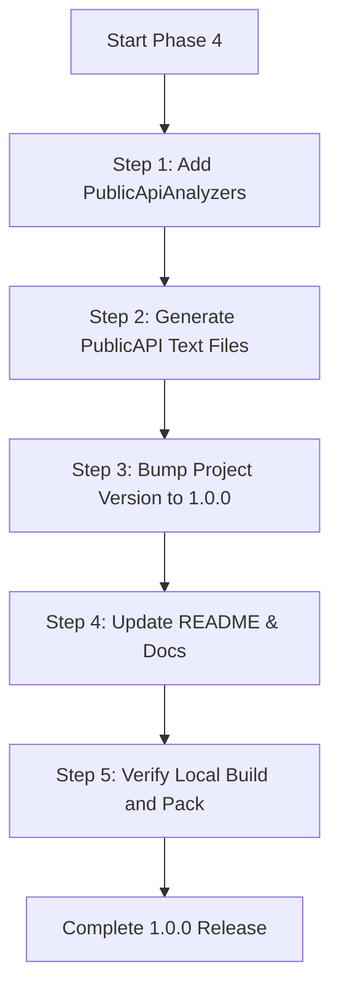

# Phase 4 — 1.0 Finalization Implementation Plan

> **For agentic workers:** REQUIRED SUB-SKILL: Use superpowers:subagent-driven-development (recommended) or superpowers:executing-plans to implement this plan task-by-task. Steps use checkbox (`- [ ]`) syntax for tracking.

**Goal:** Finalize the project metadata, lock the public API surface, and prepare the library for private `1.0.0` manual/local package distribution, explicitly omitting any public NuGet registry publishing steps.

**Architecture:** Lock the public API surface using `Microsoft.CodeAnalysis.PublicApiAnalyzers` to prevent unintended API modifications. Bump version metadata to `1.0.0` and update documentation. The existing GitHub Actions release workflow already compiles, tests, and packs the assembly to attach to GitHub Releases without public registry pushing, so it remains unchanged.



---

## File Structure

| File | Responsibility | Change |
|---|---|---|
| `Directory.Packages.props` | Central package versions | Add `Microsoft.CodeAnalysis.PublicApiAnalyzers` dependency |
| `src/FixPortal.FixAtdl/FixPortal.FixAtdl.csproj` | Library project file | Add `PublicApiAnalyzers` reference and bump version to `1.0.0` |
| `src/FixPortal.FixAtdl/PublicAPI.Shipped.txt` | **New.** Locked public API surface | Create |
| `src/FixPortal.FixAtdl/PublicAPI.Unshipped.txt` | **New.** Unshipped public API additions | Create (empty) |
| `README.md` | Repository documentation | Remove the "Pre-1.0" note and update version instructions |

---

## Tasks

- [ ] **Task 1: Add PublicApiAnalyzers dependency**
  - [ ] Add the `Microsoft.CodeAnalysis.PublicApiAnalyzers` version to `Directory.Packages.props`:
    ```xml
    <PackageVersion Include="Microsoft.CodeAnalysis.PublicApiAnalyzers" Version="3.3.4" />
    ```
  - [ ] Reference `Microsoft.CodeAnalysis.PublicApiAnalyzers` in `src/FixPortal.FixAtdl/FixPortal.FixAtdl.csproj`:
    ```xml
    <ItemGroup>
      <PackageReference Include="Microsoft.CodeAnalysis.PublicApiAnalyzers" PrivateAssets="All" />
    </ItemGroup>
    ```

- [ ] **Task 2: Initialize Public API baseline files**
  - [ ] Create two empty files in `src/FixPortal.FixAtdl/`:
    - `PublicAPI.Shipped.txt`
    - `PublicAPI.Unshipped.txt`
  - [ ] Build the project. The analyzer will emit diagnostic warnings/errors (e.g., `RS0016`) for every public symbol not listed in the tracking files.
  - [ ] Auto-generate the baseline contents using MSBuild target or by copying the diagnostics to `PublicAPI.Shipped.txt`. Alternatively, run `dotnet build /p:GeneratePublicApiBaseline=true` if supported, or manually extract the public symbols to baseline the surface.
  - [ ] Rebuild and verify that the build compiles with 0 warnings or errors once the baseline is populated.

- [ ] **Task 3: Bump project metadata to 1.0.0**
  - [ ] Update the `<Version>` element in `src/FixPortal.FixAtdl/FixPortal.FixAtdl.csproj` from `0.1.0` to `1.0.0`.
  - [ ] Verify that package tags, authors, and description are fully updated.

- [ ] **Task 4: Update README and Docs**
  - [ ] Edit `README.md` to remove the status note pointing out the pre-1.0 warning:
    - Replace: `Pre-1.0; the public surface may evolve as the FPSIM ATDL Examiner exercises it.`
    - With: `Production-ready 1.0.0 release. The public surface is locked and tracked.`
  - [ ] Update the local install usage section in `README.md` to reference `1.0.0`.

- [ ] **Task 5: Verify build & local packaging**
  - [ ] Run `dotnet build` to ensure the project builds correctly with no warnings.
  - [ ] Run `dotnet test` to confirm the test suite passes on the final code.
  - [ ] Run `dotnet pack FixPortal.FixAtdl.sln -c Release -o _pkgout` and verify `FixPortal.FixAtdl.1.0.0.nupkg` is generated successfully.

---

## Self-Review

- [x] **No Public Push**: Assured that package release logic is kept local/manual and no public registry push action is added.
- [x] **Strict warning gates**: PublicApiAnalyzers enforces that any public API changes break the build under warnings-as-errors, guaranteeing stability.
- [x] **Markdown & conventions**: Document follows Obsidian vault frontmatter, orientation blockquote, and mermaid mapping rules.
