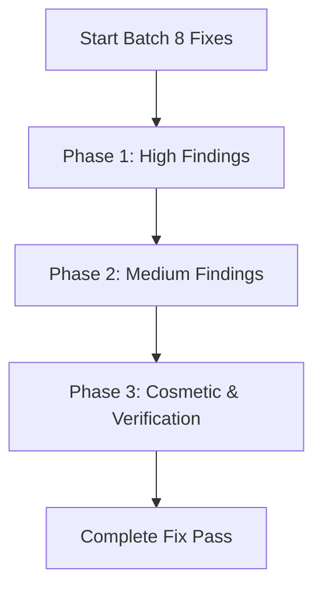

# Batch 8 — Adversarial Audit Fixes Implementation Plan

> **For agentic workers:** REQUIRED SUB-SKILL: Use superpowers:subagent-driven-development or superpowers:executing-plans to implement this plan task-by-task. Steps use checkbox (`- [ ]`) syntax for tracking.

**Goal:** Correct all High and selected Medium findings from the consolidated adversarial audit report.

---

## Tasks

### Phase 1: High Findings (Completed/In Progress)

- [x] **Task H1: EditRef-only StateRule NRE**
  - [x] Guard `stateRule.Edit` in `ReadOnlyControlCollection.UpdateRelatedHelperControls`.
  - [x] Verify compilation.

- [x] **Task H2: Mixed-numeric and cross-type edit comparisons**
  - [x] Add `NormaliseValue` and `IsNumericType` in `Edit_t.cs`.
  - [x] Use them in `AreEqual` and `EvaluateInequalityComparison`.
  - [x] Add guard check to prevent raw `ArgumentException`.

- [x] **Task H3: RepeatingGroup fail-fast**
  - [x] In `StrategiesReader.LoadStrategies`, throw `FixAtdlException` if a `RepeatingGroup` element is present.
  - [x] Add test in `StrategiesParserRejectionTests.cs`.

- [x] **Task H4: Clock_t timezone shift / Unspecified Kind**
  - [x] Reject `DateTimeKind.Unspecified` in `Clock_t.ToInstant` by throwing `ArgumentException`.
  - [x] Reject unresolvable `LocalMktTz` in `GetCurrentValue` by throwing `InvalidFieldValueException`.
  - [x] Add tests in `ClockTimeZoneTests.cs`.

- [x] **Task H5: UTCTimestamp_t / UTCTimeOnly_t sub-second precision**
  - [x] Update `UTCDateTimeTypeBase.ConvertToWireValueFormat` to choose format based on ticks.
  - [x] Update round-trip millisecond tests in `DateTimeTypeTests.cs`.

- [ ] **Task H6: IParameter.WireValue Nullability (Cosmetic)**
  - [ ] Update `IParameter.cs`, `IParameterType.cs`, `Parameter_t.cs`, `AtdlValueType.cs`, `AtdlReferenceType.cs` to use `string?` for `WireValue` / `GetWireValue`.
  - [ ] Drop `null!` suppressors in `ConvertToWireValueFormat` overrides in subclasses.

---

### Phase 2: Medium Findings

- [x] **Task M1: ReadOnlyControlCollection Replace Duplicates**
  - [x] Add duplicate ID validation in the `Replace` branch of `ReadOnlyControlCollection.cs` (inside `SetItem`).
  - [x] Throw duplicate key exception if another control has the same ID.

- [x] **Task M2: Tenor Cross-Unit Ordering**
  - [x] Update `Tenor.Compare` in `Tenor.cs` to tie-break on unit type and offsets.
  - [x] Reject `Invalid` tenor bounds.

- [x] **Task M3: MonthYear Suffix Ordering**
  - [x] Update `MonthYear.Compare` in `MonthYear.cs` to tie-break on suffix fields (day, week, ordinal).

- [x] **Task M4: DateTimeTypeBase.SetBound Stale Constraints**
  - [x] Modify `DateTimeTypeBase.SetBound` to clear the alternative constraint slots on re-set.

- [x] **Task M5: Percentage Const Scaling**
  - [x] Modify `Percentage_t.cs` to treat `ConstValue` identically to `_value` (remove dividing by 100).

- [x] **Task M6: Float/Percentage Precision Validation**
  - [x] Validate `Precision` range `[0, 28]` in `Float_t.cs`/`Percentage_t.cs`.

- [x] **Task M7: EnumTypeBase Unset Enum Selection**
  - [x] Modify `EnumTypeBase.ToEnumState` to return empty `EnumState` if `ConstValue ?? _value` is null.

- [x] **Task M8: Char_t Invalid-wire ArgumentException Leak**
  - [x] Add `ArgumentException` catch filter translation in `AtdlValueType.cs` SetWireValue.

- [x] **Task M9: Exchange_t SOH delimiter guard**
  - [x] Update `Exchange_t.ValidateValue` to call `base.ValidateValue` or apply the SOH guard.

---

### Phase 3: Low Findings

- [x] **Task L1: Boolean Serialization Consistency (`Boolean_t.ToString` & `BinaryControlBase.ToString`)**
  - [x] Implement standard `"Y"`/`"N"` serialization in `Boolean_t.ToString(IFormatProvider)`.
  - [x] Implement standard `"Y"`/`"N"` serialization in `BinaryControlBase.ToString(IFormatProvider)`.

- [x] **Task L2: Support xs:boolean integer literals `"1"`/`"0"` in `ValueConverter`**
  - [x] In `ValueConverter.cs`, map `"1"` to `"True"` and `"0"` to `"False"` for boolean types.

- [x] **Task L3: ISO-code Enum Parsing Robustness (Enum.IsDefined)**
  - [x] Validate parsed enums using `Enum.IsDefined` in `ElementFactory.cs`.

- [x] **Task L4: Format safety in ValidationResult constructor**
  - [x] Only invoke `string.Format` in `ValidationResult.cs` if `args` is non-empty.

- [x] **Task L5: Read-only globally exposed Region sets**
  - [x] Convert static mutable `HashSet<string>` sets in `RegionCountries.cs` to read-only collections.

- [x] **Task L6: Boolean `{NULL}` inbound handling**
  - [x] Reject or handle `"{NULL}"` wire values cleanly by returning `null` in `Boolean_t.ConvertFromWireValueFormat`.

---

### Phase 4: Verification & Review

- [x] Run `dotnet build` on the solution to verify no compilation errors/warnings.
- [x] Run `dotnet test` to run the entire test suite.
- [x] Adjudicate with user and sync vault changes.
