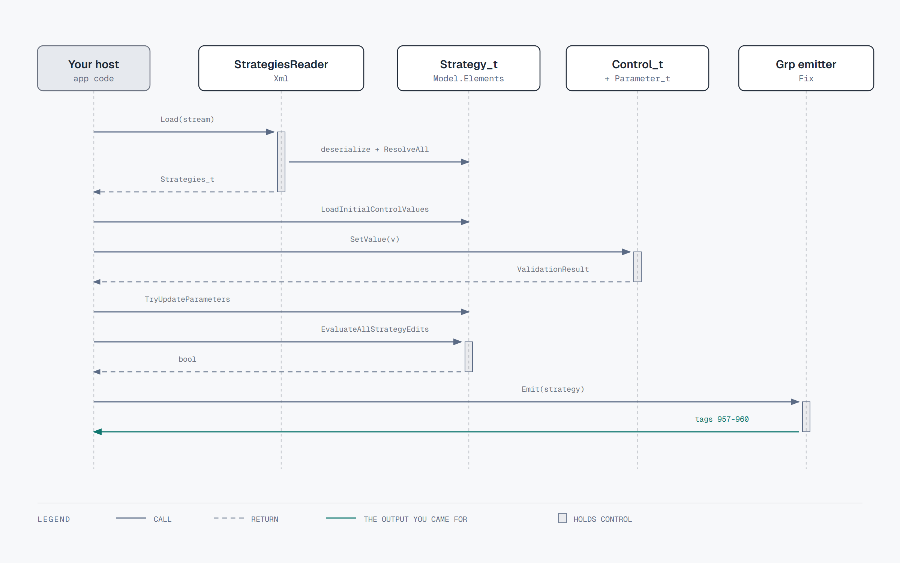

# Using FixPortal.FixAtdl

How a host application loads a FIXatdl 1.1 document, sets parameter values,
validates them, and gets FIX tag values back out. For the internal design see
[the architecture overview](architecture/README.md); for what the library has
been assessed against see [the conformance record](conformance.md).

The library is headless. It never sends anything: you get tag/value pairs and
your FIX engine puts them on the wire.



The rest of this page walks that sequence call by call. For a rendered form see the
[WPF](https://github.com/FixPortal/fixportal-fixatdl-wpf) or
[React](https://github.com/FixPortal/fixportal-fixatdl-react) adapter. The
[API reference](api.md) lists the types this page walks through.

## Loading a document

```csharp
using FixPortal.FixAtdl.Xml;

var reader = new StrategiesReader();
using var stream = File.OpenRead("twap.xml");
Strategies_t strategies = reader.Load(stream);

Strategy_t twap = strategies["TWAP"];       // by name
Strategy_t first = strategies.Strategies[0]; // by position
```

`Load` deserializes, resolves every cross-reference (`ResolveAll`), and wires the
reader's clock into each `Clock` control before returning. There is also a
`Load(string path)` overload.

The reader is hardened against XXE: DTD processing is prohibited and no external
resolver is used. Concurrent `Load` calls on one reader instance are supported.

Subscribe to `StrategiesReader.StrategyLoaded` for per-strategy progress. It is a
*deserialized*, not *fully loaded*, signal — it fires before cross-reference
resolution, which can still fail.

### Optional reader inputs

Every constructor argument is optional and defaults to current behaviour.

```csharp
var reader = new StrategiesReader(
    loggerFactory: loggerFactory,            // ILoggerFactory; default: no logging
    clock: clock,                            // NodaTime IClock; default: SystemClock
    schemaSet: schemaSet,                    // XmlSchemaSet; default: no XSD validation
    customParameterTypes: customTypes);      // vendor xsi:type registrations
```

**Schema validation.** No XSD ships with this library: the FIXatdl 1.1 schema is
FIX Protocol Limited's licensed material and cannot be redistributed here. If you
hold a licensed copy, or maintain your own XSD, load it into an `XmlSchemaSet` and
pass it — the document is validated before deserialization, and failures throw
`SchemaValidationException` carrying every error. The set is compiled eagerly in
the constructor.

**Custom parameter types.** FIXatdl 1.1 lets a vendor define a `Parameter`
`xsi:type` beyond the standard set. Register the CLR type — it may live in your
own assembly, and is used directly with no `Type.GetType` probing:

```csharp
using FixPortal.FixAtdl.Xml.Serialization;

var customTypes = new[]
{
    new CustomParameterType(
        xsiTypeName: "MyVendorCustomParam_t",   // bare local name, no prefix
        clrType: typeof(MyVendorCustomParam_t), // must implement IParameterType
        attributes: [ /* ElementAttribute mappings for this type */ ]),
};
```

The CLR type is checked at registration, so a mismatch is reported immediately
rather than from a reflection failure mid-parse. Registrations are per reader
instance and never leak into another reader's parse.

## Setting values

Two routes, depending on whether a UI is involved.

### Headless: write wire values directly

`WireValue` is the raw FIX wire-format string — a `UTCTimestamp` parameter takes
`"20260101-09:30:00"`, a `Percentage` takes its decimal wire form (`"0.1"` for 10%).

```csharp
twap.Parameters["StartTime"].WireValue = "20260101-09:30:00";
twap.Parameters["Participation"].WireValue = "0.1";
```

The setter validates against the parameter's declared type and constraints. A
rejected value throws `InvalidFieldValueException` and leaves the previous value
in place. `null` is not a legal wire value (it would mean `tag=<SOH>`) and throws
`ArgumentNullException`; use `Reset()` or `Parameters.ResetAll()` to clear.

### With a UI: go through the controls

Controls are the user-facing layer; parameters are the wire layer. Load the
control defaults, set control values, then push them into the parameters:

```csharp
twap.Controls.LoadDefaults(FixFieldValueProvider.Empty);
twap.Controls["ParticipationControl"].SetValue(0.1m);

bool ok = twap.Controls.TryUpdateParameterValues(
    twap.Parameters,
    shortCircuit: false,          // false: collect every failure
    out IList<ValidationResult>? failures);
```

`Strategy_t` exposes the same flow at strategy level —
`TryUpdateParameterValuesFromControls`, `UpdateControlValuesFromParameters`,
`LoadInitialControlValues`, `RunAllStateRules`, and `Reset`.

To seed controls from an existing order, implement `IInitialFixValueProvider`:

```csharp
sealed class OrderValues(FixTagValuesCollection values) : IInitialFixValueProvider
{
    public FixTagValuesCollection InputFixValues { get; } = values;
}

twap.LoadInitialControlValues(new FixFieldValueProvider(new OrderValues(inbound), twap.Parameters));
```

## Validation

Three mechanisms, all driven by the document:

| Mechanism | Runs when | Result |
|---|---|---|
| Parameter type and constraints | On every `WireValue` set or control update | `InvalidFieldValueException`, or a failed `ValidationResult` on the control path |
| `StrategyEdit`s | `strategy.EvaluateAllStrategyEdits(provider, shortCircuit)` | `bool`; each `StrategyEdit` holds its own error text |
| `StateRule`s | `strategy.RunAllStateRules()` | Evaluates each rule's condition into `CurrentState`. Does **not** change control enabled/visible — `Control_t` has no such flags. The host (or an adapter) reads `StateRule_t.Enabled` / `Visible` / `Value` when `CurrentState` is true and applies the effect. `{NULL}` in `Value` means clear. Precedence when two rules on the same control conflict is the adapter's. |

`ValidationResult` reports `IsValid`, `IsMissing`, and `ErrorText`. Pass
`shortCircuit: false` to collect every failure rather than stopping at the first —
that is what you want for showing a form's errors at once.

## Getting FIX values out

```csharp
FixTagValuesCollection values = twap.Parameters.GetOutputValues();

foreach (KeyValuePair<FixField, string> pair in values)
    Console.WriteLine($"{(int)pair.Key}={pair.Value}");

string wire = values.ToFix();   // tag=value pairs joined with SOH
```

`GetOutputValues` includes only parameters that have both a `fixTag` and a set
value. A parameter with no `fixTag` is local to the form and never emitted; an
unset optional parameter is skipped. An unset **required** parameter throws
`MissingMandatoryValueException` — that is the gate stopping an incomplete
strategy from reaching the wire.

### StrategyParametersGrp (tags 957–960)

For hosts using `Tag957Support` transport instead of, or alongside, direct
per-parameter tags:

```csharp
IReadOnlyList<(int Tag, string Value)> group = StrategyParametersGrpEmitter.Emit(twap);
```

Unset parameters are skipped and the 957 count reflects only those emitted; when
nothing is set, tag 957 is omitted entirely rather than emitted as an empty group.
A parameter name or wire value containing the FIX field delimiter (SOH) throws
`InvalidOperationException` rather than splitting one field into two on the wire.

Decimal wire parsing rejects a thousands separator (`"1,5"` is not `15`). Use
invariant `0.1` for ten percent on a `Percentage_t`.

## Exceptions

Every exception in `FixPortal.FixAtdl.Diagnostics.Exceptions` derives from
`FixAtdlException`, including `InternalErrorException` — which signals a broken
library invariant, so report it rather than swallowing it.

`catch (FixAtdlException)` does **not** cover the whole surface. The library
also raises BCL exception types for argument and state faults, and two of them
are reachable from the operations documented above:

| BCL type | Reachable from |
|---|---|
| `InvalidCastException` | A control asked to convert to a type its parameter cannot carry, e.g. `Clock_t.ToDecimal` |
| `InvalidOperationException` | The SOH guards in `StrategyParametersGrpEmitter.Emit` (tags 958 and 960) |
| `ArgumentException` / `ArgumentOutOfRangeException` / `ArgumentNullException` | Invalid arguments on public methods |
| `NotSupportedException` | An operation a concrete type does not implement |

Catch `FixAtdlException` for document and value faults; let the BCL types
surface as the programming errors they indicate.

| Exception | Raised when |
|---|---|
| `SchemaValidationException` | A caller-supplied `XmlSchemaSet` rejected the document; carries every error |
| `FixParseException` | A FIX message could not be parsed |
| `InvalidFieldValueException` | A value violates its parameter's type or constraints |
| `MissingMandatoryValueException` | A required parameter has no value at output time |
| `ValidationException` | A value failed a parameter constraint or a `StrategyEdit` rule |
| `ReferencedObjectNotFoundException` | A reference does not resolve — e.g. a control's `parameterRef` names no parameter |
| `InconsistentStrategyException` | The strategy is internally inconsistent, e.g. `ListItem`s but no `EnumPair`s |
| `InvalidPropertyOnObjectException` | A document supplies a property the target object does not support |
| `DuplicateKeyException` | Two items claim the same key in one collection |
| `RenderingException` | Retained for the WPF adapter (no layout / no root panel). This package no longer throws it |
| `InternalErrorException` | A library invariant broke — report it |

## Testing against a fixed clock

Time-only `initValue`s anchor to "now", so inject a clock rather than letting the
test drift:

```csharp
var clock = new FakeClock(Instant.FromUtc(2026, 1, 1, 9, 30));
var reader = new StrategiesReader(clock: clock);
```

The clock reaches every `Clock` control, which reads it lazily at `initValue`
load and value-set time.

## Known limits

- `RepeatingGroup` elements are not supported; a document containing one is
  rejected at load.
- No FIXatdl XSD is bundled (licensing, above), so structural validation is
  opt-in and only as good as the schema you supply.
- Order construction, transport, and broker-specific behaviour stay with the
  host. See [the conformance record](conformance.md) for the assessed surface.
